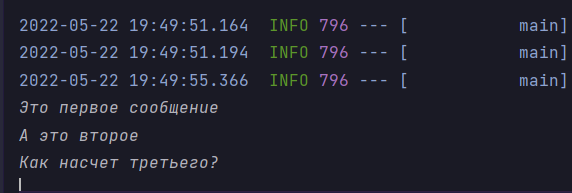
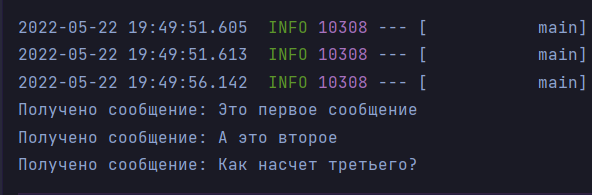

# Twelfth Homework

## Задание

1) Установить ActiveMQ. Написать два приложения: одно отправляет текст в очередь, другое читает его и выводит в консоль.
2) То же самое для Kafka.

## ActiveMQ

### Сервер

[Сервер](https://github.com/InSkipper/Java_HomeWorks/tree/TwelfthHomework/Server) - приложение, которое будет
обрабатывать сообщения из очереди. Для работы приложения понадобится [docker](https://www.docker.com/). Настроим его в
файлике [docker-compose.yml](https://github.com/InSkipper/Java_HomeWorks/blob/TwelfthHomework/Server/src/main/resources/docker-compose.yml)
. В InteliJ IDEA докер можно запустить через этот файл.

Создадим
класс [Listener](https://github.com/InSkipper/Java_HomeWorks/blob/TwelfthHomework/Server/src/main/java/com/example/defaultproject/Listener.java)
, который будет читать сообщения из очереди и выводить их в командную строку.    
Аннотация **@JmsListener** указывает на то, что данный метод является обработчиком, а destination - на имя
обрабатываемой очереди.

```java

@Component
public class Listener {
    @JmsListener(destination = "inbound.queue")
    public void receiveMessage(TextMessage jsonMessage) throws JMSException {
        System.out.println("Получено сообщение: " + jsonMessage.getText());
    }
}
```

### Клиент

[Клиент](https://github.com/InSkipper/Java_HomeWorks/tree/TwelfthHomework/Client) - приложение, с которого мы будем
отправлять сообщения в очередь **inbound.queue**.  
Создадим
класс [Produser](https://github.com/InSkipper/Java_HomeWorks/blob/TwelfthHomework/Client/src/main/java/com/example/defaultproject/Produser.java)
. С помощью внедрения зависимостей получим **JmsTemplate**. Теперь можно создать метод, который при помощи **
JmsTemplate** будет посылать сообщения в необходимую очередь.

```java

@Component
@AllArgsConstructor
public class Produser {

    private JmsTemplate template;

    public void sendMessage(String text) {
        template.send("inbound.queue", session -> session.createTextMessage(text));
    }
}
```

Теперь, если внедрить **Produser**
в [SpringBootApplication класс](https://github.com/InSkipper/Java_HomeWorks/blob/TwelfthHomework/Client/src/main/java/com/example/defaultproject/DefaultProjectApplication.java)
, можно будет воспользоваться его функционалом.

```java

@SpringBootApplication
public class DefaultProjectApplication {
    private static Produser produser;

    public DefaultProjectApplication(Produser produser) {
        DefaultProjectApplication.produser = produser;
    }

    public static void main(String[] args) {
        SpringApplication.run(DefaultProjectApplication.class, args);

        var scanner = new Scanner(System.in);
        while (scanner.hasNextLine()) {
            produser.sendMessage(scanner.nextLine());
        }
    }

}
```

## Вывод программы

Для работы программы нужно запустить 3 вещи: приложения сервера и клиента, а также контейнер в докере.

Теперь, если мы будем писать в
консоль [клиента](https://github.com/InSkipper/Java_HomeWorks/tree/TwelfthHomework/Client)...



...[сервер](https://github.com/InSkipper/Java_HomeWorks/tree/TwelfthHomework/Server) будет выводить эти сообщения.

