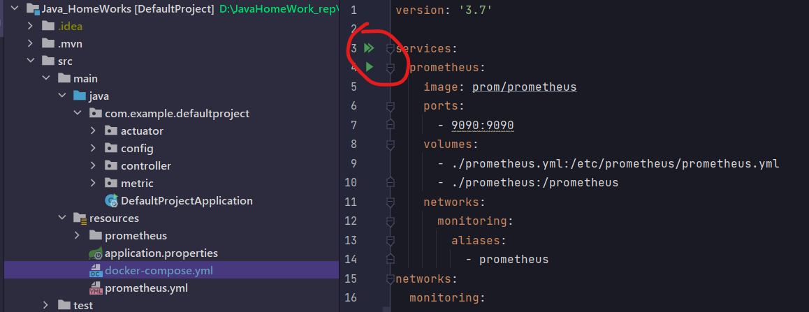
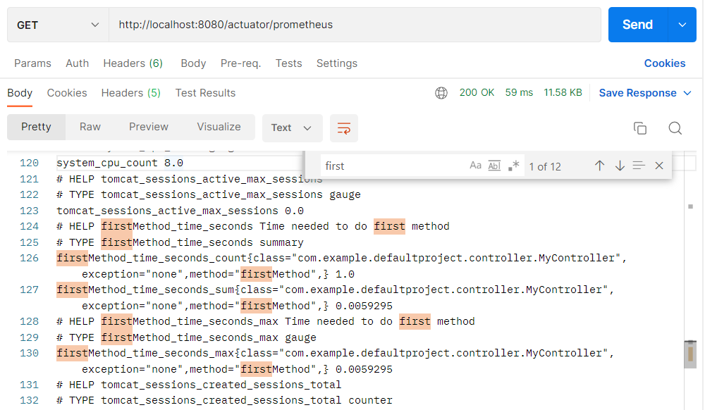
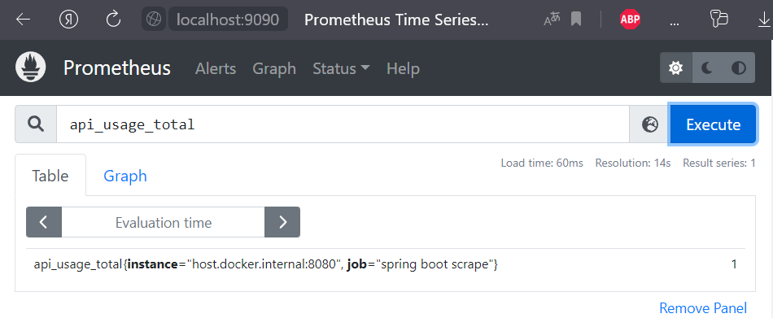
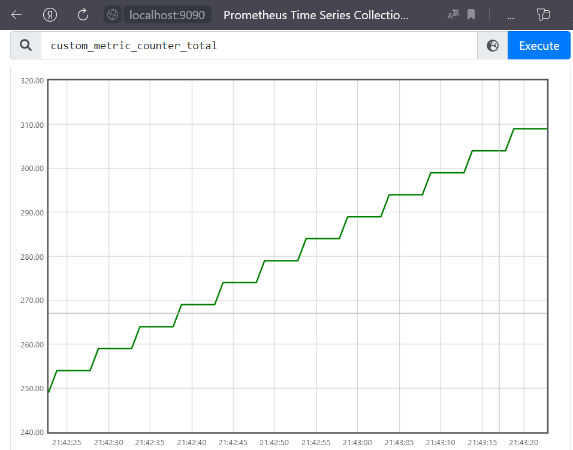

# Eleventh Homework

## Задание

1) Создать (можно использовать существующее из предыдущих заданий) веб приложение которое бы отдавало следующие метрики:

- количество запросов

- время выполнения запроса

2) Создать свою метрику. Например, количество пользователей онлайн. Можно сделать счетчик, который увеличивается через
   определенный интервал и его результат отдавать в метриках приложения

3) Создать свой актуатор. Например, при вызове которого в лог выводилось сообщение с датой и временем вызова актуатора

## Как запустить

Для визуализации метрики нужно установить [docker](https://www.docker.com/). После чего - запустить контейнер, для этого
нужно перейти по пути ```./main/resources/docker-compose.yml``` и нажать docker-compose up prometheus _(зеленый
треугольник)_.



Теперь начался сбор метрики. Можно запускать приложение обычным способом.

### Контроллер

Создадим контроллер. В нем будет считаться количество вызовов его методов и время выполнения первого метода. Все это
отдается в как метрика.

```java

@RestController
public class MyController {
    Counter counter;

    @Autowired
    public MyController(MeterRegistry registry) {
        counter = registry.counter("api.usage");
    }

    @GetMapping("/first")
    @Timed(value = "firstMethod.time", description = "Time needed to do first method")
    public String firstMethod() {
        counter.increment();
        return "First method";
    }

    @GetMapping("/second")
    public String secondMethod() {
        counter.increment();
        return "Second method";
    }
}
```

Аннотация **@Timed** непосредственно считает время выполнения метода. Для его работы советуют в конфигурационном классе
создавать **TimedAspect** бин.

```java

@Configuration
@Aspect
public class Config {
    @Bean
    public TimedAspect timedAspect(MeterRegistry meterRegistry) {
        return new TimedAspect(meterRegistry);
    }

    //...
}
```

### Своя метрика

Создадим свою метрику. Это будет счетчик, который увеличивается на 1 каждую секунду. Выполнения метода по расписанию
можно добиться с помощью аннотации **@Scheduled**. Но, просто так она работать не будет.

```java
public class CustomMetric {
    private final Counter counter;

    public CustomMetric(MeterRegistry registry) {
        counter = registry.counter("custom.metric.counter");
    }

    @Scheduled(fixedRate = 1000)
    public void metricTask() {
        counter.increment();
    }
}
```

Для того чтобы метрика отправлялась, нужно создать в конфигурационном классе **CustomMetric** бин. А для работы
аннотации **@Scheduled** нужно пометить конфиг аннотацией **@EnableScheduling**.

```java

@Configuration
@Aspect
@EnableScheduling
public class Config {
    @Bean
    public TimedAspect timedAspect(MeterRegistry meterRegistry) {
        return new TimedAspect(meterRegistry);
    }

    @Bean
    public CustomMetric customMetric(MeterRegistry registry) {
        return new CustomMetric(registry);
    }
}
```

### Свой актуатор

Создадим свой актуатор. Для этого нужно создать класс, помеченный аннотациями **@Component** и **@Endpoint**. А метод -
одной из 3 аннотаций, в данном случае это **@ReadOperation**, что соответствует **@GetMapping**.

```java

@Component
@Endpoint(id = "custom")
public class MyActuator {

    @ReadOperation
    public String getTime() {
        var dtf = DateTimeFormatter.ofPattern("dd.MM.yyyy  HH:mm:ss");
        var now = LocalDateTime.now();
        return "Текущая дата и время: " + now.format(dtf);
    }
}
```

Этот актуатор можно вызвать по url ```http://localhost:8080/actuator/custom```, где 'custom' - _endpoint id_.

### Конфиги

В **application.properties** нужно вставить строчку:

```properties
management.endpoints.web.exposure.include=health,prometheus,custom
```

Она включает _actuator endpoints_, которые выключены по умолчанию. Custom - _endpoint_ из предыдущего пункта.

**prometheus.yml** содержит конфиги _prometheus_.

## Вывод программы

По запросу ```http://localhost:8080/actuator/prometheus``` можно получить метрику в виде _prometheus_.



По запросу ```http://localhost:9090/``` открывается самое интересное - визуализация метрики.

Там можно получить отдельную метрику либо в текстовом формате, либо в виде графика.



Изменение кастомной метрики (которая увеличивается на 1 каждую секунду):

