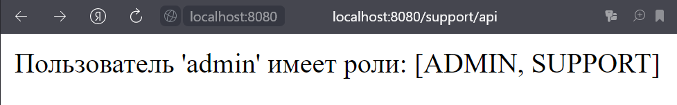

# Java Homeworks

## Задание

Реализовать приложение с разделением прав доступа АПИ:

- public/api - доступ разрешен для всех
- admin/api - доступ разрешен для пользователей с ролью admin
- support/api - доступ разрешен для пользователей с ролью support

Все приватные АПИ должны возвращать имя и роль пользователя.    
Хранение пользователей в памяти приложения (использование InMemoryUserDetailsManager).  
Для хеширования паролей использовать BCryptPasswordEncoder.     
Basic аутентификация.

### Конфиг

Настроим конфиг _Spring Security_. Для этого создадим [класс](https://github.com/InSkipper/Java_HomeWorks/blob/TenthHomework/src/main/java/com/example/defaultproject/config/SecurityConfig.java), наследуемый от **WebSecurityConfigurerAdapter**
и имеющий аннотации **@EnableWebSecurity** и **@Configuration**.

```java

@EnableWebSecurity
@Configuration
public class SecurityConfig extends WebSecurityConfigurerAdapter {

}
```

В этом [классе](https://github.com/InSkipper/Java_HomeWorks/blob/TenthHomework/src/main/java/com/example/defaultproject/config/SecurityConfig.java) переопределим метод **configure(HttpSecurity http)**. Укажем, что для запросов начинающихся с **/admin**
доступ разрешен только для пользователей с ролью **ADMIN**. Аналогично для **/support**. Для всех остальных запросов
ограничений нет. **formLogin()** создает форму для ввода логина и пароля по запросу **/login**. А **httpBasic()**
настраивает базовую аунтификация HTTP.

```java
@Override
protected void configure(HttpSecurity http) throws Exception {
    http.authorizeRequests()
            .antMatchers("/admin/**").hasRole("ADMIN")
            .antMatchers("/support/**").hasRole("SUPPORT")
            .anyRequest().permitAll()
            .and()
            .formLogin()
            .and()
            .httpBasic();
}
```

Определим **BCryptPasswordEncoder** как бин в нашей конфигкрации. Теперь мы сожем использовать для хеширования паролей.

```java
@Bean
public PasswordEncoder passwordEncoder() {
    return new BCryptPasswordEncoder();
}
```

Для создания пользователей нужно в конфигурации создать **UserDetailsService** бин. Не забываем хешировать пароли нашем
энкодером. И сохраняем пользоватей в память с помощью **InMemoryUserDetailsManager()**. В продакшене так не делается, но
для пробы пера сойдет.

```java
@Bean
public UserDetailsService userDetailsService() {
    var admin = User.builder()
            .username("admin")
            .password(passwordEncoder().encode("admin"))
            .roles("ADMIN", "SUPPORT")
            .build();

    var user = User.builder()
            .username("user")
            .password(passwordEncoder().encode("user"))
            .roles("USER")
            .build();

    var support = User.builder()
            .username("support")
            .password(passwordEncoder().encode("support"))
            .roles("SUPPORT")
            .build();

    return new InMemoryUserDetailsManager(admin, user, support);
}
```

## Вывод программы

При запросе ```/public/api``` модно быть не авторизованным. В любом случае выводится сообщение **Public**.


При запросе ```/support/api``` можно быть авторизованным как **ADMIN** и как **SUPPORT**. В этом случае на экран
выводится имя пользователя и его роли.


